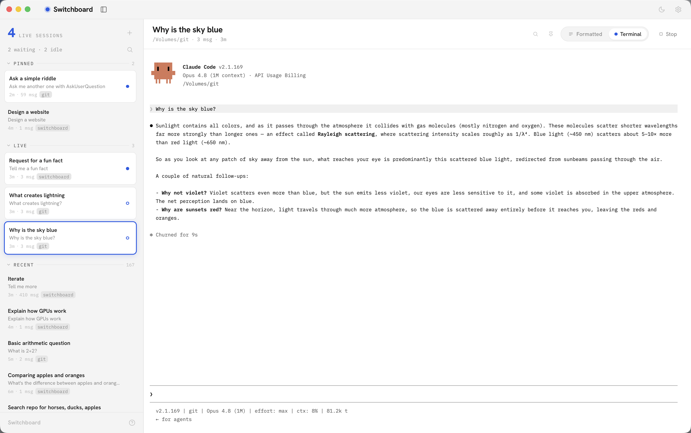
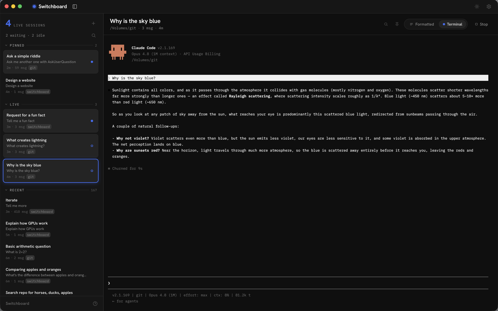

# Switchboard

A **switchboard** for your Claude Code conversations. A single unified app to use **your** Claude Code setup. Preview and search all conversations instantly (without starting Claude), run sessions in parallel, and pin important conversations.

## Screenshots





## Set up

Clone the repo and navigate to the root directory:

```bash
git clone git@github.com:adambgordon/switchboard.git
cd switchboard
```

**Ask Claude to finish setting up for you**. Ask Claude:

```
Set up Switchboard
```

*Installs any missing prerequisites, builds the app, and opens it for you.*

And you're done.

**Or, manually:**

```bash
npm run setup
open dist/mac-arm64/Switchboard.app
```

*`npm run setup` installs dependencies, rebuilds the native terminal module (`node-pty`) against Electron's ABI, and packages the app into `dist/mac-arm64/Switchboard.app`.*

## Use it like a normal Mac app

Switchboard is a plain `.app` — no separate installer.

- **Add to your dock** — drag or pin it to your dock like any other application
- **Quit** — `⌘Q` (automatically ends all live sessions then quits the application)
- Optional — drag `Switchboard.app` into /Applications (or just keep running it from dist/)

Because you built it locally, macOS doesn't quarantine it — it opens without the "unidentified developer" warning a downloaded app would trigger.

## Updates

**Ask Claude to update for you.** Ask Claude:

```
Update Switchboard
```

*Pulls the latest, rebuilds, and reopens the app.*

**Or, manually:**

```bash
git pull
npm run setup
```

Then quit (⌘Q) (if already running) and reopen the app.

## Requirements

- **macOS** on **Apple Silicon** — built and validated there; Intel is untested.
- **[Claude Code](https://claude.com/claude-code)** installed and on your `PATH`. Switchboard reads the sessions Claude Code writes and drives the `claude` CLI — it does nothing useful without it.
- **Node.js 26** — see [`.nvmrc`](.nvmrc) (`nvm use` picks it up).
- **Xcode Command Line Tools** — the embedded terminal (`node-pty`) compiles native code. Install with `xcode-select --install`.


## What it does

- **Browse** — reads the JSONL files Claude Code already writes under `~/.claude/projects/`; titles and previews update live as a file watcher re-indexes. Switchboard owns no data of its own.
- **Preview without disturbing** — click any conversation to render its transcript instantly from disk. **No `claude` process is started**, so you can click through dozens to find the one you want.
- **Resume / start, explicitly** — the only way to spawn a live process is **Resume** (`claude --resume`) or **New** (`claude --session-id`), each dropping you into a real terminal.
- **Formatted ⇄ Terminal** — for a live conversation, toggle between the raw **Terminal** (where you type) and a **Formatted** view that re-renders the transcript as a clean log and stays pinned to the latest message. The choice sticks per conversation.
- **Copy from the transcript** — in the **Formatted** view, hover a turn (beside its timestamp), a code block, a table, or a tool call/result for a copy button: a turn copies as markdown (tool I/O excluded); code and tables copy their raw source. Each flashes a check when copied.
- **Pin & organize** — the left pane has three collapsible sections: **Pinned**, **Live** (running now), and **Recent**. Pins persist across restarts; live and pinned rows drag to reorder; a cobalt dot tracks each live conversation's turn-state — working, waiting on your reply, finished-unread, or seen.
- **Right-click any row** — a quick menu to rename the conversation, copy the session ID, resume or stop a session, and mark it read or unread. **⌥-click** a live row (or its terminal) to mark it unread directly.
- **Rename & inspect** — click a conversation's title at the top of the pane to open an info card: folder, git branch, model, message count, size, duration, token usage, last activity, and session ID — values are selectable to copy (and session ID has a one-click copy). Rename **in place** right in the heading. Renames are real: they write Claude Code's own title record, so they carry into `claude --resume` too.
- **Search, two kinds** — fuzzy search *across* conversations (titles, previews, directories), and find-in-conversation (`⌘F`) that highlights every match in the Formatted transcript, including inside collapsed tool calls and clamped results.
- **Navigate by keyboard** — switch conversations with `⌥⌘↑` / `⌥⌘↓` (the main pane stays focused, so you can type or hit `⏎` to resume), browser-style back/forward, and more (see below).
- **Default start folder** — set a default directory in Preferences so **New** (`⌘N`) skips the folder picker and starts there.
- **Light & dark** — neutral light and near-black dark themes; **System** follows the macOS appearance live. Flip from the title-bar toggle or Preferences.

_For the design rationale and implementation invariants, see [`CLAUDE.md`](CLAUDE.md)._

## Keyboard

| Key | Action |
| --- | --- |
| `⌘N` | New conversation (directory picker, or your default directory if one is set) |
| `⌘F` | Find in the conversation (main pane focused) — or search the list (otherwise) |
| `⏎` / `⇧⏎` | In the find bar: next / previous match |
| `⌥⌘↑` / `⌥⌘↓` | Previous / next conversation — lands focused in the main pane (type right away, or `⏎` to resume) |
| `⏎` | Resume the selected conversation from its transcript — or, if it's already live, focus into its terminal |
| `⇧⌘U` | Mark the selected conversation read / unread |
| `⌥-click` | Mark a conversation unread — a live row in the list, or its terminal |
| `⌘[` / `⌘]` | Back / forward through the conversations you've opened |
| `⌘B` | Toggle the pane |
| `⌘,` | Open Preferences (the title-bar gear opens the same dialog) |
| `⌘?` | Open Preferences to the Shortcuts page (the footer `?` button does the same) |
| `Esc` | Close the find bar / clear the query and close search / close menu / close Preferences |
| `⌘Q` | Quit — ends all live sessions |
| `⌘+` / `⌘−` / `⌘0` | Zoom in / out / reset |
| `⌘R` | Refresh the terminal — forces a clean redraw (does **not** reload) |

## Develop

To work on Switchboard itself, skip the packaged app and use the hot-reload loop:

```bash
npm install
npm run rebuild      # rebuild node-pty for Electron's ABI (first run / after an Electron bump)
npm run dev          # launch with hot reload
```

Run several dev instances side by side by labeling each window:

```bash
SWITCHBOARD_DEV_LABEL=wip npm run dev   # tags the window title + title bar
```

Quality gates:

```bash
npm run typecheck    # tsc over main (node) and renderer (web) projects
npm test             # vitest — parser / indexer / customTitle unit tests
SWITCHBOARD_SMOKE=1 node_modules/.bin/electron .   # headless boot check: node-pty spawns + renderer loads
```

> `npm run package` (which `npm run setup` wraps) rebuilds the `.app` from scratch. `npm run build` alone refreshes `out/` for `npm run dev` but does **not** update the packaged app.

## Architecture

```
build/                     app icon — icon.svg (source) → icon.png + icon.icns
scripts/                   rebuild-native.mjs (node-pty ABI) · setup.mjs (one-shot build)
src/
  shared/types.ts          IPC contract + data types (no node/DOM imports)
  main/                    Electron main process (Node)
    index.ts               window, security (CSP lives in index.html), lifecycle, dev dock icon, boot self-test (SWITCHBOARD_SMOKE)
    ipc.ts                 IPC handlers; owns the file watcher + PtyManager
    sessions/              parser.ts · indexer.ts · watcher.ts  (read ~/.claude/projects)
    pty/manager.ts         spawns login shells, types the claude command; output activity → LRU eviction (configurable cap, default 8)
  preload/index.ts         contextBridge → typed window.api (contextIsolation on)
  renderer/                React 18 + Vite
    App.tsx                two-column layout + state orchestration (per-conversation view memory, back/forward history)
    components/            TitleBar · MainPane · PaneHeader · TranscriptView · TranscriptSearch ·
                           TerminalDeck/TerminalView · TallyRail · ResizeHandle · SettingsModal · TooltipLayer · …
    lib/                   useSessions · usePtys · usePins · useSeen · useWindowFocus · useLayout · useTheme · useTranscript ·
                           useNavHistory · useSyncedAnimation · useRailFlip · useTranscriptSearch · useAutoHideScrollbar ·
                           messageGroups · fuzzy · findMatches · ptyStream · format
    styles/                tokens.css (design system) + per-zone CSS
```

Everything the UI shows is derived from the session **JSONL files** Claude Code writes — Switchboard never owns conversation data. A `chokidar` watcher re-indexes on change, which is what keeps the pane titles and the Formatted view live.

### Why a login shell?

A GUI Electron app inherits a minimal `PATH` (no `~/.local/bin`, no Homebrew), so invoking `claude` directly fails. Switchboard spawns your **login + interactive shell** (`$SHELL -l -i`) — which sources your profile and gets the real `PATH` — then types the `claude` command into it. Bonus: when `claude` exits you're left at a normal prompt, exactly like Terminal.app.

## Security

`contextIsolation: true`, `nodeIntegration: false`. The renderer talks to the main process only through the typed `window.api` bridge. A CSP restricts the renderer to local resources; external links open in the system browser.

## Notes / limitations

- macOS-first (built and validated on macOS + Apple Silicon, Electron 42, Node 26).
- `node-pty` is a native module; `npm run rebuild` matches it to Electron's ABI.
- **Concurrent resume:** resuming a conversation that is *also* live in an external terminal is not guarded — two processes appending to one JSONL will interleave. For now, avoid it.
- The Formatted view is read-only and updates at message granularity (when Claude flushes to disk), not keystroke-by-keystroke. A find match must fall within a single rendered text node, so a phrase split across styled runs (e.g. a bold word) won't match.
- **Liveness is derived from the transcript turn-state** (not terminal output): the live dot reads working / waiting-on-you / finished-unread / finished-seen. A couple of states can't be told apart from what's on disk (a turn blocked on a permission prompt, or `claude` crashing while its shell survives) and still read as *working*.
- The renderer bundle is ~1 MB (react-markdown + xterm.js).
