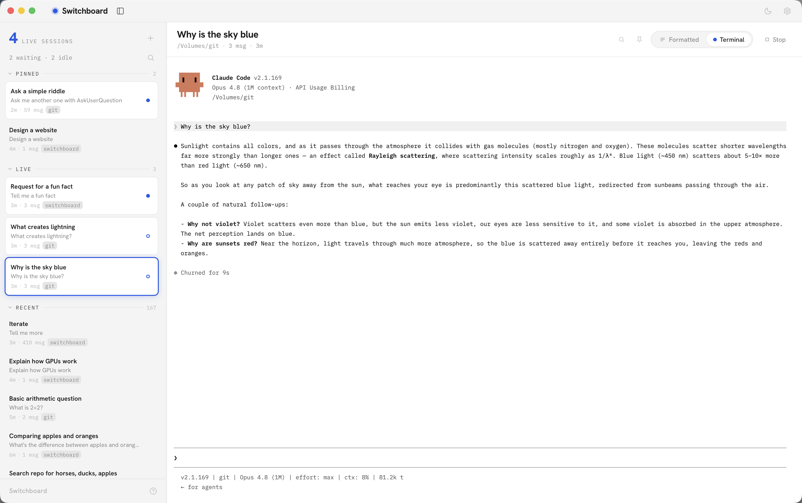
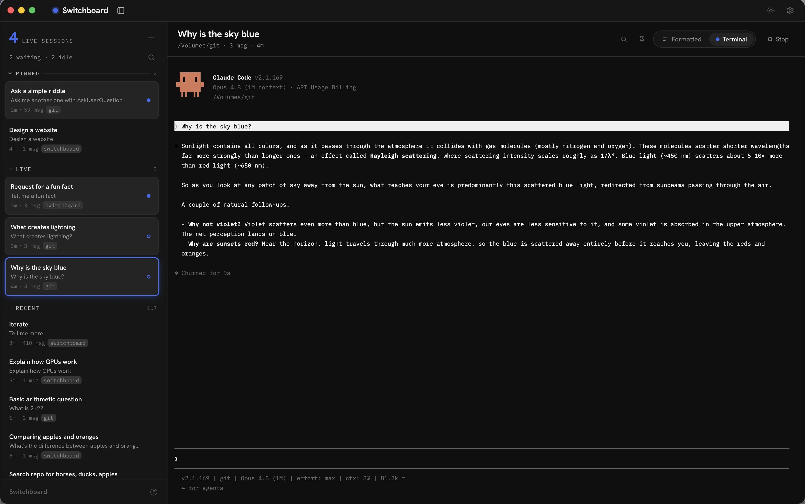

# Switchboard

A **switchboard** for your AI coding-agent conversations — **Claude Code and Codex**, side by side. A single unified app over **your** existing setup: preview and search every conversation instantly (without starting an agent), resume or start sessions in parallel, and pin the important ones.

## Screenshots






## Set up

Clone the repo and navigate to the root directory:

```bash
git clone git@github.com:adambgordon/switchboard.git
cd switchboard
```

**Ask Claude to finish setting up for you**. Ask Claude:

```
Set up Switchboard
```

*Installs any missing prerequisites, builds the app, and opens it for you.*

And you're done.

**Or, manually:**

```bash
npm run setup
open dist/mac-arm64/Switchboard.app
```

*`npm run setup` installs dependencies, rebuilds the native terminal module (`node-pty`) against Electron's ABI, and packages the app into `dist/mac-arm64/Switchboard.app`.*

## Use it like a normal Mac app

Switchboard is a plain `.app` — no separate installer.

- **Add to your dock** — drag or pin it to your dock like any other application
- **Quit** — `⌘Q` (automatically ends all live sessions then quits the application)
- Optional — drag `Switchboard.app` into /Applications (or just keep running it from dist/)

Because you built it locally, macOS doesn't quarantine it — it opens without the "unidentified developer" warning a downloaded app would trigger.

## Updates

**In the app** — Switchboard checks at startup and every 30 minutes while running, including in the background. An overdue check runs after waking from sleep. To check immediately, open Preferences (`⌘,`) → **Application** → **Updates**. If you're behind, **Download update** pulls the latest and rebuilds in place (a few minutes), then **Relaunch** loads the new build. A dot on the gear (and the **Application** row) marks when an update is waiting. *(Needs the app running from its built `dist/` folder; if you moved it elsewhere, it shows you the manual command below instead.)*

**Or ask Claude:**

```
Update Switchboard
```

*Pulls the latest, rebuilds, and reopens the app.*

**Or, manually:**

```bash
git pull
npm run setup
```

Then quit (⌘Q) (if already running) and reopen the app.

## Requirements

- **macOS** on **Apple Silicon** — built and validated there; Intel is untested.
- **At least one supported agent** on your `PATH` — **[Claude Code](https://claude.com/claude-code)** and/or **Codex** (OpenAI's `codex` CLI). Switchboard reads the sessions each agent writes and drives its CLI; it browses whatever's already on disk and launches whichever agents are installed. Both is the happy path, but either alone works.
- **Node.js 26** — see [`.nvmrc`](.nvmrc) (`nvm use` picks it up).
- **Xcode Command Line Tools** — the embedded terminal (`node-pty`) compiles native code. Install with `xcode-select --install`.


## What it does

- **Browse** — reads the session files each agent already writes (Claude Code's JSONL under `~/.claude/projects/`, Codex's rollouts under `~/.codex/sessions/`), grouped together by folder so a repo's conversations from both agents sit side by side; titles and previews update live as a file watcher re-indexes. A Claude Code background continuation appears beside the original (whose transcript stops at the handoff) as its own independently resumable row; repeated handoffs can therefore produce several rows from one lineage. Each background row is marked by a dashed ring around the Claude logo; internal Claude daemons and delegated Codex sessions, including approval reviews, are omitted. Recognized Codex subagents are also removed from restored tabs and skipped by Back/Forward. Automatically derived Codex names use a bounded first-line title, including when copied. Switchboard owns no data of its own.
- **Preview without disturbing** — click any conversation to render its transcript instantly from disk. **No `claude` process is started**, so you can click through dozens to find the one you want.
- **Resume / start, explicitly** — the only way to spawn a live process is **Resume** or **New**, each dropping you into a real terminal running the right agent (`claude --resume` / `codex resume`, and so on). **New** lets you pick the agent when more than one is installed.
- **Formatted ⇄ Terminal** — click the view toggle or press **⌘J** in the focused pane to switch between the raw **Terminal** (where you type) and a **Formatted** view that renders both your prompts and the agent's replies as Markdown — with syntax-highlighted code blocks — and stays pinned to the latest message. If the conversation is not live, **⌘J** resumes it and focuses its terminal. The chosen view and each Formatted reading position stick per conversation while the app is open; hovering a link reveals its URL.
- **Copy from the transcript** — in the **Formatted** view, ⌘C preserves Markdown formatting only when selected non-whitespace content extends beyond either end of the complete component. Exact and partial selections copy its content without its outer markers; nested styles are evaluated independently. Selected whitespace and code indentation are preserved. Multi-item lists keep complete items’ markers; table selections use tabs/newlines unless selected non-whitespace content extends beyond either end of the whole table. In Markdown mode, eligible formatting inside cells survives even in tab-separated output. Multi-cell fields containing tabs, newlines, or quotes are quoted; a single cell stays unquoted. Selections crossing speaker sections gain attribution. Only expanded tools and the displayed portion of clamped results participate. **Preferences → Application → Copy as markdown** switches to plain text.
- **Copy buttons** — hover a turn, code block, table, or tool input/result for its copy button; the transcript footer also offers **Copy entire conversation**. Turn and conversation copies include prose and image labels, always exclude tools, and preserve complete formatting when **Copy as markdown** is on. **Copy table** copies the complete Markdown table or tab-separated plain text. Code, JSON, and result buttons always copy the complete bare payload, including content hidden by a result’s clamp. Right-click inline code for **Copy Code**. Each button flashes a check when copied.
- **Copy a link target** — right-click any link in the **Formatted** view for **Copy Link** (or **Copy Path**, for a file path). Web links also offer **Open Link in Browser**; only `http(s)` opens, so a path can be copied but never launched.
- **Tabs, a split, and extra windows** — keep several conversations open at once. Clicking one previews it in a **replaceable** tab (shown italic), so browsing a list doesn't pile up tabs; double-clicking it, or resuming it, makes that tab stick. Tabs wrap onto more rows as they accumulate, or stay in a single horizontally scrolling row with **Preferences → Beta Features → Tab layout → Scroll**. The layout choice is available while tabs are enabled and is remembered when they are turned off. Tabs keep their width when a session starts or stops, and drag to reorder — across the split, or out into a window of their own. **Split Right** puts a second pane beside the first; **Move to New Window** opens a conversation on its own, rail hidden until you press `⌘B`. ⌘-click or ⇧-click tabs to select several and close or move them together. A conversation is only ever open in **one** place — asking for one that's already open takes you to it rather than opening a second copy. Your tabs come back where you left them after a restart, as transcripts — nothing is resumed on your behalf, so no agent starts running because you reopened the app. Still settling in, so it starts **off** — turn it on at **Preferences → Beta Features → Tabs and split view**, or leave it off for one conversation at a time.
- **Pin & organize** — the left pane has three collapsible sections: **Pinned**, **Live** (running now), and **Recent**. Pins persist across restarts; live and pinned rows drag to reorder; a cobalt dot tracks each live conversation's turn-state — working, waiting on your reply, finished-unread, or seen.
- **Row menu (⋮)** — each row's **⋮** button (or a right-click) opens a quick menu to pin/unpin, open **Session details**, resume or stop a session, and mark it read or unread. **⌥-click** a live row (or its terminal) to mark it unread directly.
- **Rename & inspect** — click a conversation's title at the top of the pane (or right-click a row → **Session details**) to open an info card: agent, folder, git branch, model, message count (visible human/agent prose or image messages, not tool plumbing), size, duration, token usage (per-agent categories) plus current context size, last activity, and session ID — values are selectable to copy (and session ID has a one-click copy). Rename **in place** right in the heading — press **Enter** to save. Renames are real and go through each agent's *own* store — Claude Code's title record (carries into `claude --resume`), Codex's app-server `thread/name/set` — never a Switchboard-private one.
- **Search, two kinds** — fuzzy search *across* conversations (titles, previews, directories), and find-in-conversation (`⌘F`) that highlights matches in human and agent messages, including their code blocks. Tool sections are excluded, whether collapsed or expanded.
- **Navigate by keyboard** — switch conversations with `⌥⌘↑` / `⌥⌘↓` (the main pane stays focused, so you can type or hit `⏎` to resume), app-wide back/forward through conversation and Formatted/Terminal visits, and more (see below). History follows a tab wherever it lives and reopens a closed tab as a preview; restoring a Terminal visit only uses an existing live terminal and never starts an agent. Navigation history resets when you quit.
- **Defaults for New** — set a default directory and/or a default agent in Preferences so **New** (`⌘N`) skips the picker(s) and starts there with that agent.
- **Light & dark** — neutral light and near-black dark themes; **System** follows the macOS appearance live. Flip from the title-bar toggle or Preferences → Appearance, where you can also pick a light or dark **dock icon** independent of the theme.

_For the design rationale and implementation invariants, see [`CLAUDE.md`](CLAUDE.md)._

## Keyboard

| Key | Action |
| --- | --- |
| `⌘N` | New conversation (directory picker, or your default directory if one is set) |
| `⌘F` | Find in the conversation (main pane focused) — or search the list (otherwise) |
| `⌘J` | Toggle Formatted / Terminal in the focused pane; resume if not already live |
| `⏎` / `⇧⏎` | In the find bar: next / previous match |
| `⌥⌘↑` / `⌥⌘↓` | Previous / next conversation — lands focused in the main pane (type right away, or `⏎` to resume) |
| `⏎` | Resume the selected conversation from its transcript — or, if it's already live, focus into its terminal |
| `⇧⌘U` | Mark the selected conversation read / unread |
| `⌥-click` | Mark a conversation unread — a live row in the list, or its terminal |
| `⌘[` / `⌘]` | Back / forward through conversation and view visits across all windows |
| `⌘B` | Toggle the pane |
| `⌘W` / `⇧⌘W` | Close the focused tab group (or current tab) / close the window |
| `⌘1`–`⌘9` | Jump to a tab by position |
| `⌥⌘←` / `⌥⌘→` | Previous / next tab (wraps, and continues across the split) |
| `⌘\` | Split the view, or close the split |
| `⇧⌘N` | Open the selected conversation in a new window |
| `⌘-click` / `⇧-click` | On a tab: add it to the selection / select the run up to it |
| `⌘,` | Open Preferences (the title-bar gear opens the same dialog) |
| `⌘?` | Open Preferences to the Shortcuts page |
| `Esc` | Close the find bar / clear the query and close search / close menu / close Preferences |
| `⌘Q` | Quit — ends all live sessions |
| `⌘+` / `⌘−` / `⌘0` | Zoom in / out / reset |
| `⌘R` | Refresh the current view — forces a clean redraw without reloading; Codex Terminal returns to the latest output |

## Develop

To work on Switchboard itself, skip the packaged app and use the hot-reload loop:

```bash
npm install
npm run rebuild      # rebuild node-pty for Electron's ABI (first run / after an Electron bump)
npm run dev          # launch with hot reload
```

Run several dev instances side by side by labeling each window:

```bash
SWITCHBOARD_DEV_LABEL=wip npm run dev   # tags the window title + title bar
```

Quality gates:

```bash
npm run typecheck    # tsc over main (node) and renderer (web) projects
npm test             # vitest — unit tests (parser, indexer, liveness, theme, rename, …)
npm run test:tabs-ui  # native Electron tab rendering, zoom, drag, and overflow regression
npm run test:copy-ui  # transcript copy events, Markdown fidelity, pointer selection, and clipping
SWITCHBOARD_SMOKE=1 node_modules/.bin/electron .   # headless boot check: node-pty spawns + renderer loads
```

The tab rendering check mounts the real tab component with sample conversations, exercises native zoom commands and hold-and-reverse drags in both themes, and compares horizontal and vertical border coverage. It requires a macOS graphical session and leaves screenshots and measurements in the printed temporary directory. The copy check uses real copy events and re-renders copied Markdown to verify its text and formatting, without changing the system clipboard.

> `npm run package` (which `npm run setup` wraps) rebuilds the `.app` from scratch. `npm run build` alone refreshes `out/` for `npm run dev` but does **not** update the packaged app.

## Architecture

```
build/                     app icon — icon.svg (source) → icon.png + icon.icns
scripts/                   rebuild-native.mjs (node-pty ABI) · setup.mjs (one-shot build)
src/
  shared/                  types.ts (IPC contract + data types) · messageCount.ts (canonical visible-message count)
  main/                    Electron main process (Node)
    index.ts               window, security (CSP lives in index.html), lifecycle, dev dock icon, boot self-test (SWITCHBOARD_SMOKE)
    ipc.ts                 IPC handlers; owns the file watcher + PtyManager
    navigation.ts          app-wide visit routing + guarded playback (navigationHistory.ts = pure history transitions)
    menu.ts                custom app menu — ⌘R→Refresh (no reload roles), File/View/Window
    windowState.ts         persists window bounds/position across launches
    trafficLights.ts       re-aligns the native traffic lights to the page zoom (renderer pings on resize)
    updater.ts             self-update: git ls-remote check + git-pull/rebuild + relaunch (updater-core.ts = pure helpers)
    updateChecks.ts        shared update-check cache, coalescing, and 30-minute background schedule
    sessions/              parser · indexer · watcher · rename · codexParser · codexThreadsDb · codexSessionIndex · codexRename  (read ~/.claude/projects + ~/.codex/sessions)
    pty/manager.ts         spawns login shells, types the agent command; holds the live-session cap (configurable, default 8)
    pty/evictionPolicy.ts  which live terminal the cap may stop — turn-state and real use, never terminal output
    pty/codexInputNotifications.ts  scans explicit Codex OSC 9 question/approval notifications for live-dot liveness
    pty/agentEnv.ts        removes inherited agent runtime identity while preserving explicit configuration (pure, unit-tested)
    pty/bootCommand.ts     per-agent boot command + Ctrl-E/Ctrl-U line-clear so stray prompt content can't fuse onto it (pure, unit-tested)
  preload/index.ts         contextBridge → typed window.api (contextIsolation on)
  renderer/                React 18 + Vite
    App.tsx                two-column layout + state orchestration (per-conversation view memory, app-wide navigation adapter)
    components/            TitleBar · MainPane · PaneHeader · TranscriptView · TranscriptSearch ·
                           TerminalDeck/TerminalView · TallyRail · ResizeHandle · SettingsModal · UpdatesSetting · AppVeil · TooltipLayer · …
    lib/                   useSessions · usePtys · usePins · useSeen · useWindowFocus/focusSync · useLayout · useTheme · useDarkIcon · useTranscript ·
                           useAppNavigation · useMaxLiveSessions · useMarkdownCopy · useSyncedAnimation/animationSync · useRailFlip ·
                           useTranscriptSearch · useAutoHideScrollbar · messageGroups · clipboard · mdCopy/mdCopyDom/mdCopyAst ·
                           maxLiveScale · fuzzy · findMatches · ptyStream · format
    styles/                tokens.css (design system) + per-zone CSS
```

Everything the UI shows is derived from the session files each agent writes (Claude Code's JSONL, Codex's rollouts + its `state_*.sqlite` for titles) — Switchboard never owns conversation data. A `chokidar` watcher re-indexes on change, which is what keeps the pane titles and the Formatted view live.

> Deeper reference for contributors: [`docs/architecture.md`](docs/architecture.md) (module map + state), [`docs/design.md`](docs/design.md) (visual / UX invariants), and [`docs/gotchas.md`](docs/gotchas.md) (subsystem traps).

### Why a login shell?

A GUI Electron app inherits a minimal `PATH` (no `~/.local/bin`, no Homebrew), so invoking `claude` directly fails. Switchboard spawns your **login + interactive shell** (`$SHELL -l -i`) — which sources your profile and gets the real `PATH` — then types the `claude` command into it. Bonus: when `claude` exits you're left at a normal prompt, exactly like Terminal.app.

## Security

`contextIsolation: true`, `nodeIntegration: false`. The renderer talks to the main process only through the typed `window.api` bridge. A CSP restricts the renderer to local resources; external links open in the system browser.

## Notes / limitations

- macOS-first (built and validated on macOS + Apple Silicon, Electron 42, Node 26).
- `node-pty` is a native module; `npm run rebuild` matches it to Electron's ABI.
- **Concurrent resume:** resuming a conversation that is *also* live in an external terminal is not guarded — two processes appending to one JSONL will interleave. For now, avoid it.
- The Formatted view is read-only and updates at message granularity (when Claude flushes to disk), not keystroke-by-keystroke. A find match must fall within a single rendered text node, so a phrase split across styled runs (e.g. a bold word) won't match.
- Codex rebuilds terminal scrollback after a resize. Switchboard caps that replay at 1,000 rows to keep resizing responsive — dragging the split divider or resizing the window rebuilds it each time — so use the Formatted view for reliable full-history reading in longer conversations.
- **Liveness is derived primarily from transcript turn-state**, not generic terminal output: the live dot reads working / waiting-on-you / finished-unread / finished-seen. Explicit Codex OSC notifications are the narrow exception, covering questions and approvals in Switchboard-owned terminals that are absent from the rollout. Claude permission prompts and a `claude` crash whose shell survives still cannot be distinguished from working state.
- **LaTeX math** renders in the Formatted view for both agents (`\(…\)` / `$…$` inline, `\[…\]` / `$$…$$` display). Detection is deliberately conservative, and applies **per text block** (a message can hold several, and each is judged on its own): a block counts as math only if it contains a display equation whose delimiters are alone on their own lines, and a bare `$…$` counts only in a block that also wrote display math with `$$`. Code — fenced, indented, or inline — is excluded entirely, so a LaTeX sample stays a sample. That leaves `\[DEBUG\]`, `sed`/`jq` expressions, and `$PATH` alone, at the cost of occasionally showing real math as source, which is the intended trade.
- The renderer bundle is ~2 MB (react-markdown + xterm.js); KaTeX is a separate chunk loaded only when a conversation actually contains math.
